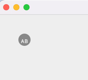

Issue https://github.com/JetBrains/compose-multiplatform/issues/3453  
Inconsistency in Material3 between Android vs Desktop (and iOS)

### Desktop and iOS




### Android


### Code:
```Kotlin
@Composable
fun App() {
    MaterialTheme {
        Box(modifier = Modifier.size(100.dp), Alignment.Center) {
            CircleWithText()
        }
    }
}

@Composable
fun CircleWithText() {
    Box(Modifier.size(24.dp), contentAlignment = Alignment.Center) {
        Canvas(modifier = Modifier.fillMaxSize()) {
            drawCircle(SolidColor(Color.Gray))
        }
        Text(
            text = "AB",
            color = Color.White,
            fontSize = 10.sp,
            modifier = Modifier.fillMaxSize(),
            textAlign = TextAlign.Center,
        )
    }
}
```
